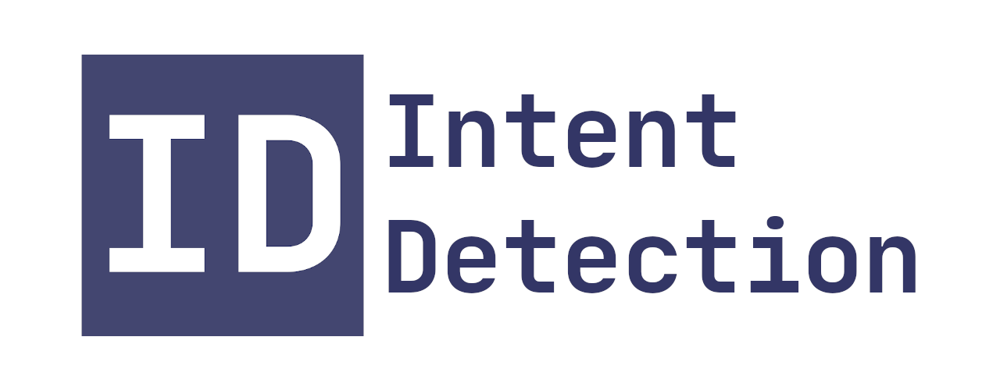

This is a easy to use implementation of abusive intent detection.
It is based on the research done for my Master's.

Abusive intent is defined as a statement of future action or desire to negatively impact a target individual or group.
Simply put, the model is designed to find text where someone states that they are/want to do something in the future.
This statement should also contain abusive language, since we are most interested in malicious actions.

## Usage

To setup the 
